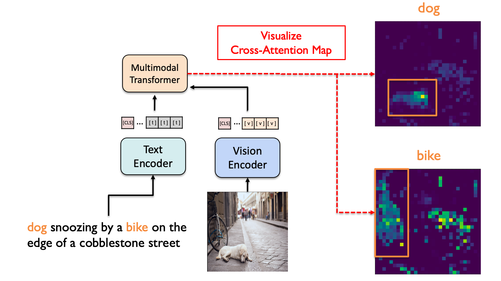

# Verifying Vision-Language Alignment with Cross-Attention Map
  
최근 연구가 활발한 Vision Transformer를 self-supervised로 학습하는 방법 중 하나로 **DINO**가 있습니다.  
저자들은 DINO의 self-attention map을 시각화한 결과, 이미지 속 객체를 매우 뚜렷하게 구분하는 것을 확인했습니다.  
Semantic segmentation 정보를 주지 않았음에도 불구하고, 아래와 같이 객체를 잘 구분해 많은 관심을 받았습니다.  

Vision Transformer의 마지막 layer에서 [CLS] 토큰과 다른 patch들 사이의 self-attention map을 시각화 했으며,  
특정 객체 위치에 해당하는 patch와 다른 patch들 사이를 시각화했을 때도 관련있는 부분들의 attention이 높았습니다. 

자세한 내용은 **Emerging Properties in Self-Supervised Vision Transformers**(ICCV 2021)을 참고해주시기 바랍니다.  
[[`blogpost`](https://ai.facebook.com/blog/dino-paws-computer-vision-with-self-supervised-transformers-and-10x-more-efficient-training)] [[`arXiv`](https://arxiv.org/abs/2104.14294)] [[`Yannic Kilcher's video`](https://www.youtube.com/watch?v=h3ij3F3cPIk)]

<div align="center">
  
</div>
  
## Cross-attention visualization
[ALBEF(NeurIPS 2021, Spotlight)](https://arxiv.org/abs/2107.07651)와 같은 최신 Vision-Language model에서는  
Transformer의 self-attention이 아닌 **cross-attention**으로 이미지와 언어 사이의 정보를 통합했습니다.  
DINO의 unimoal 결과를 확장해 멀티모달 transformer의 cross-attention map을 확인해 보고 싶었습니다.  
  
vision-language에 대한 학습이 잘 이루어졌다면, 문장의 각 단어와 이미지 내 객체 사이의 alignment를  
cross-attention map으로 어느정도 확인할 수 있을 것이라고 생각했습니다.  
그리고 COCO 데이터셋의 텍스트-이미지 쌍 데이터에 대해 ALBEF 모델의 cross-attention map을 시각화한 결과,  
다소 noisy 하지만 단어와 객체 사이의 상관관계를 파악할 수 있었습니다.  
  
<div align="center">
  
</div>

## Usage
1. [DINO github](https://github.com/facebookresearch/dino)을 참고해 환경설정을 해줍니다.
2. [ALBEF github](https://github.com/salesforce/ALBEF)에 있는 사전학습된 모델을 다운받습니다.
3. visualize_attn_upper.sh 파일의 path 수정 후 실행

```
sh visualize_attn_upper.sh 
```
## Conclusion
해당 결과를 통해 supervised 방식으로 단어와 이미지를 matching 해주지 않아도,  
Self-supervised learning 과정에서 연관성을 학습함을 알 수 있습니다.  
객체와 관련 없는 부분도 높은 attention 값을 가지지만,  
이는 모델이 이미지를 이해할 때 객체 뿐만 아니라 배경도 함께 고려하는 것으로 해석할 수 있습니다.
  
최근 CLIP, DALL-E 등 vision-language domain에 대한 관심이 높아지고 있는 상황에서  
해당 시각화 방법이 멀티모달 transformer를 해석하고 이해하는 데 도움이 되길 희망합니다.
  
  
  
## License
This repository is released under the Apache 2.0 license as found in the [LICENSE](LICENSE) file.

## Citation
If you find this repository useful, please consider giving a star :star: and citation :t-rex::
```
@inproceedings{caron2021emerging,
  title={Emerging Properties in Self-Supervised Vision Transformers},
  author={Caron, Mathilde and Touvron, Hugo and Misra, Ishan and J\'egou, Herv\'e  and Mairal, Julien and Bojanowski, Piotr and Joulin, Armand},
  booktitle={Proceedings of the International Conference on Computer Vision (ICCV)},
  year={2021}
}
```
